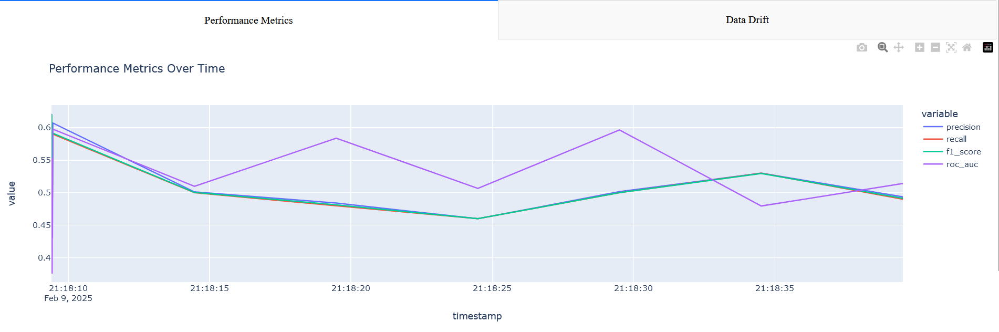
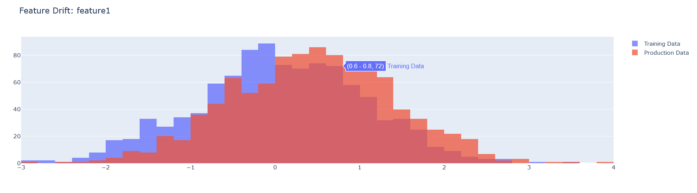
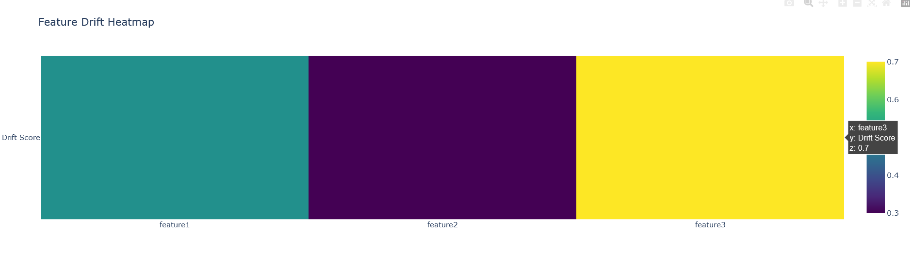

# 🛡️ DriftGuard - ML Model Drift & Performance Monitoring

<div align="center">

[](https://www.python.org/)
[](LICENSE)
[](https://opensource.org/)

**A comprehensive, open-source tool for monitoring and detecting ML model drift, concept drift, and performance degradation in production environments.**

</div>

---

## 📋 Overview

DriftGuard is designed to monitor and detect **data drift**, **concept drift**, and track the performance of machine learning models over time. It provides interactive visualizations and intelligent alerts for anomalies, making it easier to maintain and improve the performance of deployed models.

### ✨ Core Features

- 📊 **Data Drift Detection** - Detect changes in input data distributions
- 🔍 **Concept Drift Detection** - Identify shifts in input-output relationships  
- 📈 **Performance Monitoring** - Track metrics over time (accuracy, precision, recall, F1, ROC-AUC)
- 📉 **Interactive Dashboards** - Visualize drift and performance metrics
- 🔔 **Smart Alerts** - Get notified via email, Slack, or custom channels
- 💾 **Historical Logging** - Store metrics and statistics for analysis

---

## 🎯 Key Features

### 📊 Data Drift Detection
Monitors changes in input data distribution using state-of-the-art statistical tests:

| Test | Type | Features |
|------|------|----------|
| **Kolmogorov-Smirnov** | Univariate | Numerical features |
| **Chi-Square** | Categorical | Discrete distributions |
| **Wasserstein Distance** | Optimal Transport | Numerical features |
| **Jensen-Shannon Divergence** | Information Theory | Numerical/Categorical |

- ✅ Feature-wise distribution comparison
- ✅ Training vs. Production data analysis

### 🔍 Concept Drift Detection  
Detects fundamental changes in the relationship between inputs and outputs:

- **ADWIN** - Adaptive Windowing algorithm for continuous drift detection
- **DDM** - Drift Detection Method for online learning scenarios
- **Page-Hinkley** - Sequential change-point detection

### 📈 Performance Monitoring
Real-time tracking of key machine learning metrics:

- Accuracy, Precision, Recall, F1-Score, ROC-AUC
- Training vs. Production performance comparison
- Trend analysis and historical performance tracking

### 📉 Visualization & Dashboards
Interactive dashboards featuring:

- ⏱️ Time-series plots for metric trends
- 📊 Histograms for distribution analysis
- 🔥 Heatmaps for feature correlation
- 🎨 Professional, customizable visualizations

### 🔔 Intelligent Alerting
Multiple notification channels:

- 📧 Email alerts for drift detection
- 💬 Slack integration for team notifications
- 🔌 Extensible alert system for custom channels

### 💾 Storage & Logging
- Historical metric tracking
- Drift statistics logging
- *Coming Soon:* Cloud integration (AWS, Azure, GCP)

---

## 🚀 Quick Start

### Prerequisites
- Python 3.8 or higher
- pip or conda package manager

### Installation

Install all required dependencies:

```bash
pip install -r requirements.txt
```

### Basic Usage

#### Running Drift Detection

Use the example scripts to see DriftGuard in action:

```python
python examples/concept_drift.py
python examples/monitoring.py
```

#### Launching the Dashboard

Visualize drift and performance metrics with the interactive dashboard:

```bash
python src/visualization/example.py
```

**Dashboard Screenshots:**

<div align="center">







</div>

---

## 📁 Project Structure

```
DriftGuard/
├── src/
│   ├── data_drift/           # Data drift detection algorithms
│   ├── concept_drift/        # Concept drift detection methods
│   ├── llm/                  # LLM-specific drift monitoring
│   ├── monitoring/           # Performance monitoring utilities
│   ├── alerting/             # Alert system and channels
│   ├── visualization/        # Dashboard and plotting components
│   └── utils/                # Helper functions and utilities
├── examples/                 # Example scripts and demos
├── tests/                    # Unit tests and test cases
├── assets/                   # Images and visual resources
├── requirements.txt          # Python dependencies
├── setup.py                  # Package configuration
└── README.md                 # Documentation
```

---

## 🛠️ Technology Stack

- **Core Framework:** Python 3.8+
- **Data Processing:** NumPy, Pandas
- **Visualization:** Matplotlib, Plotly, Seaborn
- **Machine Learning:** Scikit-learn
- **Notifications:** Email, Slack API
- **Web Dashboard:** Streamlit (or similar)

---

## 📚 Documentation

For detailed usage guides and API documentation, check out:
- [DEMO_GUIDE.md](DEMO_GUIDE.md) - Complete walkthrough with examples
- Example scripts in the `examples/` directory
- Source code documentation in each module

---

## 🤝 Contributing

Contributions are welcome! Feel free to:
- Report bugs and issues
- Submit pull requests with improvements
- Suggest new features or enhancements
- Improve documentation

---

## 📞 Get In Touch

Have questions or feedback? Reach out through any of these channels:

<div align="center">

| Channel | Link |
|---------|------|
| 🐦 **Twitter** | [@ghyathmoussa11](https://twitter.com/ghyathmoussa11) |
| 💼 **LinkedIn** | [Ghyath Moussa](https://www.linkedin.com/in/ghyath-moussa-83834516b/) |
| 📧 **Email** | [gheathmousa@gmail.com](mailto:gheathmousa@gmail.com) |

</div>

---

## 📄 License

This project is licensed under the MIT License - see the [LICENSE](LICENSE) file for details.

---

<div align="center">

**Made with ❤️ for the ML community**

[⬆ Back to top](#-driftguard---ml-model-drift--performance-monitoring)

</div>